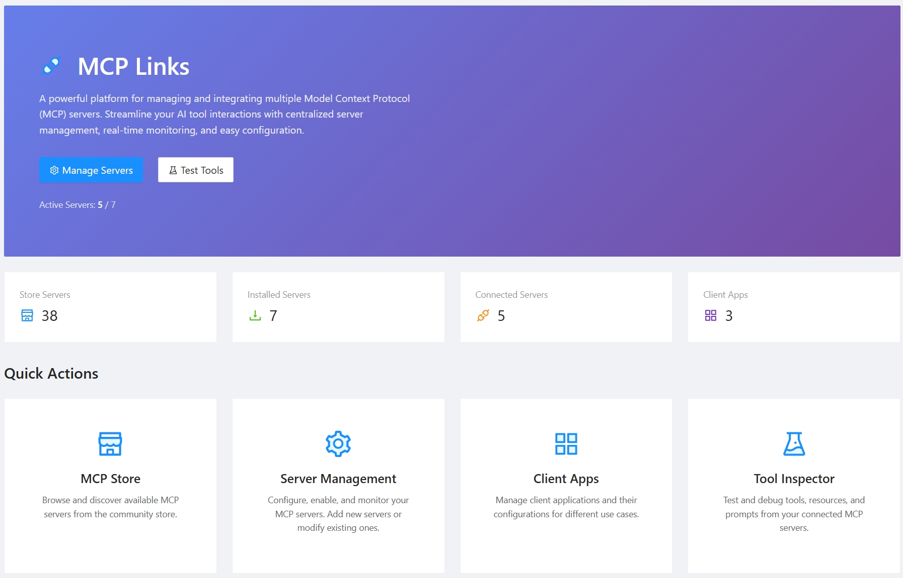

[简体中文](README_zh-cn.md) | [English](README.md)




# Mcp.Links

A powerful Model Context Protocol (MCP) aggregator built with .NET 9.0 that enables seamless integration and management of multiple MCP servers. This project provides both HTTP and command-line interfaces for aggregating various MCP servers into a unified platform.

## 🚀 Features

- **Multi-Protocol Support**: Aggregates MCP servers via stdio, HTTP, and SSE protocols
- **Web Management Interface**: Intuitive Blazor-based UI for managing MCP servers and client applications
- **MCP Store**: Built-in marketplace for discovering and installing pre-configured MCP servers
- **Authentication**: Built-in API key authentication for secure access
- **Real-time Inspector**: Monitor and inspect MCP server communications
- **Client App Management**: Configure different client applications with specific MCP server access
- **Tool Aggregation**: Seamlessly combine tools from multiple MCP servers
- **Docker Support**: Ready-to-deploy containerized solution
- **Multi-environment Support**: Configurable for development and production environments

## 📦 Installation & Usage

### ⚡ Quick Start

Get started quickly using the pre-built Docker image:

```bash
# Run with default configuration
docker run -p 8080:8080 ghcr.io/sheng-jie/mcp-links:v0.4

# Run with custom configuration files
docker run -p 8080:8080 \
  -v $(pwd)/mcp.json:/app/mcp.json \
  -v $(pwd)/client-apps.json:/app/client-apps.json \
  ghcr.io/sheng-jie/mcp-links:v0.4
```

The application will be available at `http://localhost:8080` with the MCP endpoint at `/mcp`.

### 📋 Prerequisites

- .NET 9.0 SDK
- Node.js (for running Node-based MCP servers)
- Python 3.x with uv/uvx (for Python-based MCP servers)

### 1. HTTP Server Mode (Recommended)

Run the web-based management interface:

```bash
dotnet run --project src/Mcp.Links.Http/Mcp.Links.Http.csproj
```

The server will start on `http://localhost:5146` with the MCP endpoint available at `/mcp`.

### 2. Configuration

#### MCP Servers Configuration (`mcp.json`)

```json
{
  "mcpServers": {
    "fetch": {
      "enabled": true,
      "type": "stdio",
      "command": "uvx",
      "args": ["mcp-server-fetch"],
      "env": {
        "node-env": "dev",
        "port": "3300"
      }
    },
    "time": {
      "enabled": true,
      "type": "stdio", 
      "command": "uvx",
      "args": ["mcp-server-time", "--local-timezone=Asia/Shanghai"]
    },
    "csharp-api": {
      "enabled": false,
      "type": "http",
      "url": "https://api.example.com/mcp"
    }
  }
}
```

#### Client Applications Configuration (`client-apps.json`)

```json
{
  "mcpClients": [
    {
      "appId": "vscode",
      "appKey": "your-api-key-here",
      "name": "VS Code",
      "description": "VS Code MCP client",
      "mcpServerIds": ["fetch", "time"]
    }
  ]
}
```

### 3. Build and Deploy with Docker

Build and run with Docker:

```bash
# Build the image
docker build -t mcp-links .

# Run the container
docker run -p 8080:8080 \
  -v $(pwd)/mcp.json:/app/mcp.json \
  -v $(pwd)/client-apps.json:/app/client-apps.json \
  mcp-links
```

### 4. Custom Configuration File

Specify a custom configuration file:

```bash
dotnet run --project src/Mcp.Links.Http/Mcp.Links.Http.csproj --mcp-file=/path/to/custom-mcp.json
```


## 🔧 Supported MCP Server Types

### Stdio Servers
- **Python-based**: Using `uvx` or `pip` installed packages
- **.NET-based**: Using `dnx` command with .NET tools
- **Node.js-based**: Using `npx` or globally installed packages

### HTTP Servers
- RESTful MCP servers with standard HTTP endpoints
- Custom authentication header support

### SSE (Server-Sent Events)
- Real-time streaming MCP servers
- Event-based communication

## 🎯 Use Cases

- **AI Development**: Aggregate multiple AI tools and services into a single MCP interface
- **Enterprise Integration**: Centralize various business tools and APIs
- **Development Workflow**: Combine code analysis, documentation, and deployment tools
- **Research Platform**: Integrate data analysis, visualization, and machine learning tools
- **Rapid Prototyping**: Quickly discover and integrate MCP servers from the built-in store
- **Multi-client Management**: Configure different tool sets for various AI clients (VS Code, Cursor, Claude Desktop)

## 🔒 Security Features

- **API Key Authentication**: Secure access control for client applications
- **Client-specific Server Access**: Granular permissions for different client applications
- **Environment Isolation**: Separate configurations for different environments
- **Request Validation**: Built-in request validation and error handling

## 🌐 Web Interface Features

The web management interface provides:

- **Server Management**: Add, edit, disable/enable MCP servers
- **MCP Store**: Browse and install MCP servers from a curated marketplace featuring 40+ pre-configured servers including:
  - **AI Services**: Time conversion, web search (Brave, Perplexity, Zhipu), image generation (EverArt, MiniMax)
  - **Development Tools**: GitHub/GitLab integration, Figma context, browser automation (Playwright, Puppeteer)
  - **Database Access**: PostgreSQL, Redis, Neon database management
  - **Content & Communication**: Slack integration, email sending (Mailtrap), note-taking (Flomo)
  - **Location Services**: Google Maps, Baidu Maps, Amap Maps with geocoding and routing
  - **Specialized Tools**: Blender 3D modeling, sequential thinking, AWS knowledge base retrieval
- **Real-time Monitoring**: View server status and communication logs
- **Tool Inspector**: Browse available tools from all connected servers
- **Client App Management**: Configure API keys and server access for different clients
- **Configuration Editor**: Direct editing of JSON configuration files
- **Internationalization**: Support for multiple languages (English, Chinese)

## 📊 Monitoring & Debugging

- **Health Checks**: Monitor the status of all connected MCP servers
- **Request Logging**: Track all MCP communications for debugging
- **Error Handling**: Comprehensive error reporting and recovery
- **Performance Metrics**: Monitor response times and server performance

## 🚀 Development & Extension

### Adding New MCP Servers

1. Update your `mcp.json` configuration
2. Restart the application or use hot-reload
3. Verify connectivity through the web interface

### Custom Transport Types

The system supports extending with custom transport implementations by implementing the transport interfaces in the core library.

## 🤝 Contributing

Contributions are welcome! Please feel free to submit pull requests, report issues, or suggest new features.

## 📄 License

This project is licensed under the terms specified in the [LICENSE.txt](LICENSE.txt) file.

---

**Built with ❤️ using .NET 9.0, Blazor Server, and the MCP C# SDK**
