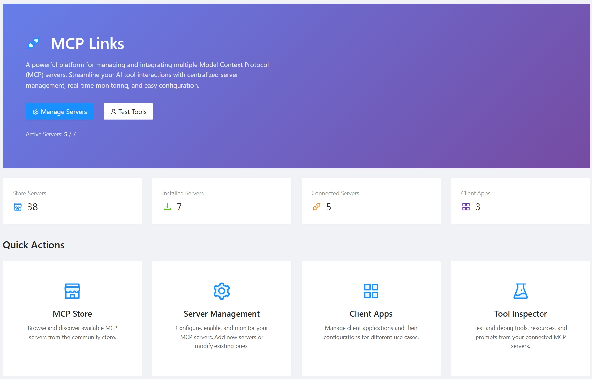

[English](README.md) | [简体中文](README_zh-cn.md)



# Mcp.Links

一个基于 .NET 9.0 构建的强大的模型上下文协议 (MCP) 聚合器，能够无缝集成和管理多个 MCP 服务器。该项目提供 HTTP 和命令行接口，将各种 MCP 服务器聚合到统一平台中。

## 🚀 特性

- **多协议支持**: 通过 stdio、HTTP 和 SSE 协议聚合 MCP 服务器
- **Web 管理界面**: 基于 Blazor 的直观 UI，用于管理 MCP 服务器和客户端应用
- **MCP 商店**: 内置市场，用于发现和安装预配置的 MCP 服务器
- **身份验证**: 内置 API 密钥认证，确保安全访问
- **实时检查器**: 监控和检查 MCP 服务器通信
- **客户端应用管理**: 配置不同的客户端应用，授予特定 MCP 服务器访问权限
- **工具聚合**: 无缝组合多个 MCP 服务器的工具
- **Docker 支持**: 可即时部署的容器化解决方案
- **多环境支持**: 可配置开发和生产环境

## 📦 安装和使用

### ⚡ 快速开始

使用预构建的 Docker 镜像快速启动：

```bash
# 使用默认配置运行
docker run -p 8080:8080 ghcr.io/sheng-jie/mcp-links:v0.4

# 使用自定义配置文件运行
docker run -p 8080:8080 \
  -v $(pwd)/mcp.json:/app/mcp.json \
  -v $(pwd)/client-apps.json:/app/client-apps.json \
  ghcr.io/sheng-jie/mcp-links:v0.4
```

应用程序将在 `http://localhost:8080` 可用，MCP 端点位于 `/mcp`。

### 📋 前置条件

- .NET 9.0 SDK
- Node.js（用于运行基于 Node 的 MCP 服务器）
- Python 3.x 带 uv/uvx（用于基于 Python 的 MCP 服务器）

### 1. HTTP 服务器模式（推荐）

运行基于 Web 的管理界面：

```bash
dotnet run --project src/Mcp.Links.Http/Mcp.Links.Http.csproj
```

服务器将在 `http://localhost:5146` 启动，MCP 端点可在 `/mcp` 访问。

### 2. 配置

#### MCP 服务器配置 (`mcp.json`)

```json
{
  "mcpServers": {
    "fetch": {
      "enabled": true,
      "type": "stdio",
      "command": "uvx",
      "args": ["mcp-server-fetch"],
      "env": {
        "node-env": "dev",
        "port": "3300"
      }
    },
    "time": {
      "enabled": true,
      "type": "stdio", 
      "command": "uvx",
      "args": ["mcp-server-time", "--local-timezone=Asia/Shanghai"]
    },
    "csharp-api": {
      "enabled": false,
      "type": "http",
      "url": "https://api.example.com/mcp"
    }
  }
}
```

#### 客户端应用配置 (`client-apps.json`)

```json
{
  "mcpClients": [
    {
      "appId": "vscode",
      "appKey": "your-api-key-here",
      "name": "VS Code",
      "description": "VS Code MCP 客户端",
      "mcpServerIds": ["fetch", "time"]
    }
  ]
}
```

### 3. 构建和部署 Docker

使用 Docker 构建和运行：

```bash
# 构建镜像
docker build -t mcp-links .

# 运行容器
docker run -p 8080:8080 \
  -v $(pwd)/mcp.json:/app/mcp.json \
  -v $(pwd)/client-apps.json:/app/client-apps.json \
  mcp-links
```

### 4. 自定义配置文件

指定自定义配置文件：

```bash
dotnet run --project src/Mcp.Links.Http/Mcp.Links.Http.csproj --mcp-file=/path/to/custom-mcp.json
```

## 🔧 支持的 MCP 服务器类型

### Stdio 服务器
- **基于 Python**: 使用 `uvx` 或 `pip` 安装的包
- **基于 .NET**: 使用 `dnx` 命令和 .NET 工具
- **基于 Node.js**: 使用 `npx` 或全局安装的包

### HTTP 服务器
- 具有标准 HTTP 端点的 RESTful MCP 服务器
- 支持自定义认证头

### SSE (Server-Sent Events)
- 实时流式 MCP 服务器
- 基于事件的通信

## 🎯 使用场景

- **AI 开发**: 将多个 AI 工具和服务聚合到单一 MCP 接口
- **企业集成**: 集中管理各种业务工具和 API
- **开发工作流**: 组合代码分析、文档和部署工具
- **研究平台**: 集成数据分析、可视化和机器学习工具
- **快速原型开发**: 从内置商店快速发现和集成 MCP 服务器
- **多客户端管理**: 为不同的 AI 客户端（VS Code、Cursor、Claude Desktop）配置不同的工具集

## 🔒 安全特性

- **API 密钥认证**: 客户端应用的安全访问控制
- **客户端特定服务器访问**: 不同客户端应用的细粒度权限
- **环境隔离**: 不同环境的独立配置
- **请求验证**: 内置请求验证和错误处理

## 🌐 Web 界面功能

Web 管理界面提供：

- **服务器管理**: 添加、编辑、禁用/启用 MCP 服务器
- **MCP 商店**: 浏览和安装来自精选市场的 MCP 服务器，包含 40+ 个预配置服务器：
  - **AI 服务**: 时间转换、网络搜索（Brave、Perplexity、智谱）、图像生成（EverArt、MiniMax）
  - **开发工具**: GitHub/GitLab 集成、Figma 上下文、浏览器自动化（Playwright、Puppeteer）
  - **数据库访问**: PostgreSQL、Redis、Neon 数据库管理
  - **内容与通信**: Slack 集成、邮件发送（Mailtrap）、笔记记录（Flomo）
  - **位置服务**: Google Maps、百度地图、高德地图，支持地理编码和路线规划
  - **专业工具**: Blender 3D 建模、序列思维、AWS 知识库检索
- **实时监控**: 查看服务器状态和通信日志
- **工具检查器**: 浏览所有连接服务器的可用工具
- **客户端应用管理**: 为不同客户端配置 API 密钥和服务器访问权限
- **配置编辑器**: 直接编辑 JSON 配置文件
- **国际化**: 支持多种语言（英文、中文）

## 📊 监控和调试

- **健康检查**: 监控所有连接的 MCP 服务器状态
- **请求日志**: 跟踪所有 MCP 通信用于调试
- **错误处理**: 全面的错误报告和恢复
- **性能指标**: 监控响应时间和服务器性能

## 🚀 开发和扩展

### 添加新的 MCP 服务器

1. 更新您的 `mcp.json` 配置
2. 重启应用程序或使用热重载
3. 通过 Web 界面验证连接性

### 自定义传输类型

系统支持通过在核心库中实现传输接口来扩展自定义传输实现。

## 🤝 贡献

欢迎贡献！请随时提交 pull request、报告问题或建议新功能。

## 📄 许可证

本项目在 [LICENSE.txt](LICENSE.txt) 文件中指定的条款下获得许可。

---

**使用 .NET 9.0、Blazor Server 和 MCP C# SDK 用 ❤️ 构建**
